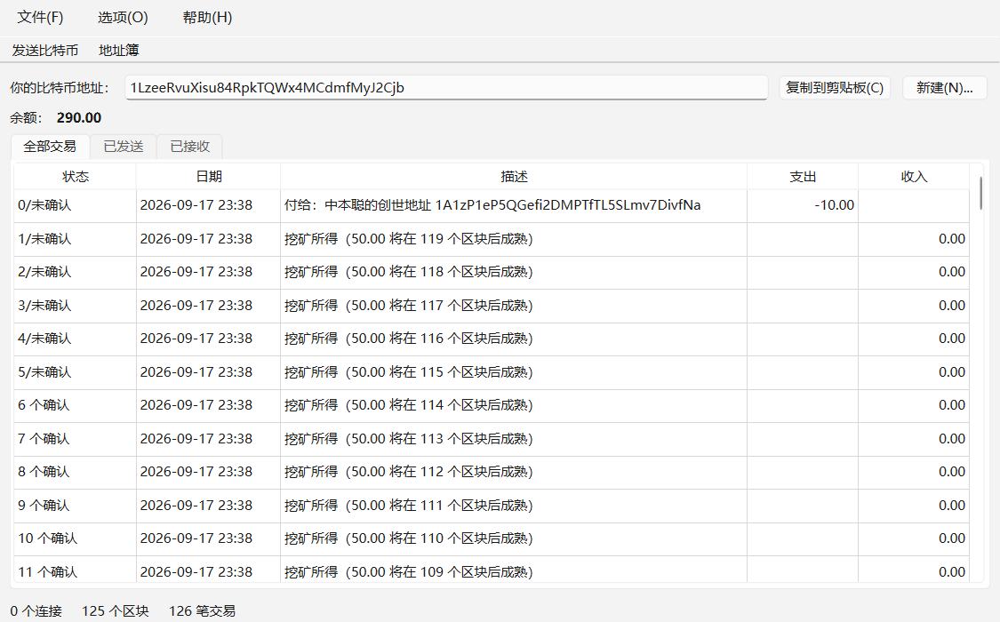

# Bitcoin v0.1.5 — a pure-Python re-creation

A faithful, educational re-creation of [Satoshi Nakamoto's Bitcoin v0.1.5
ALPHA](https://github.com/bitcoin/bitcoin/tree/v0.1.5) (2009) in pure
Python, with the original wxWidgets UI rebuilt in Qt (PySide6). It runs
its own private network: mine blocks, send coins between nodes on your
machine, and watch the 2009 protocol work end to end.



> **This is a toy.** The network is private, the difficulty is tiny, the
> wallet stores plaintext keys in JSON. Never use it for anything of value.

## Quick start

```powershell
python -m venv .venv
.\.venv\Scripts\Activate.ps1
pip install -r requirements.txt
pytest                       # 97 tests, including a 2-node socket sync

# two-node GUI demo (or just run demo_two_nodes.ps1):
python run_gui.py -datadir=data\nodeA -port=18444
python run_gui.py -datadir=data\nodeB -port=18445 -connect=127.0.0.1:18444
```

Demo script: enable **Options → Generate Bitcoins** on node A and watch
the block count climb in both status bars. Generated coins mature after
120 blocks (the original's 100 + 20 safety margin) — at private-net speed
that's a couple of minutes. Then copy node B's address, hit **Send
Coins** on A, and watch the payment appear 0/unconfirmed on B and confirm
with the next block. `run_node.py` runs the same node headless; `-gen`
starts mining immediately.

## What is faithfully replicated

Verified against the actual v0.1.5 sources:

* **Wire protocol 105**: 20-byte message header — magic `F9 BE B4 D9`,
  12-byte command, length, and **no checksum** (that arrived in 0.2.x).
  No `verack`, no `ping`. Message set: `version addr inv getdata
  getblocks tx block getaddr`, including magic-scan resync, chunked
  500-block `getblocks` replies with `hashContinue`, and orphan-block
  backfill requests.
* **Consensus**: 80-byte headers hashed with SHA256d; 50 BTC subsidy
  halving every 210,000 blocks; retarget every 2016 blocks with the
  [1/4, 4×] clamp *and* the original `nInterval-1` off-by-one; best chain
  chosen by height (chain-work came later); orphan block maps;
  100-confirmation coinbase maturity; `MAX_SIZE` 32 MiB (no 1 MB block
  limit yet).
* **Script**: the full v0.1.5 opcode set with CBigNum (arbitrary
  precision) numbers — nothing was disabled yet in 0.1.5. Verification
  evaluates `scriptSig + OP_CODESEPARATOR + scriptPubKey` in a **single
  concatenated run**, the way 0.1.x did. `SignatureHash` keeps the
  famous "return 1" out-of-range quirk; `OP_CHECKMULTISIG` pops its
  extra stack element. Standard templates are P2PK and P2PKH only.
* **Transactions**: fee rule `(1 + bytes/1000) * CENT` with free
  transactions under 10,000 bytes and the sub-cent-output CENT minimum;
  `mapTransactions`/`mapNextTx` mempool semantics.
* **Wallet**: no key pool — a brand-new key for every change output and
  every generated block; one `fSpent` flag per transaction (outputs are
  spent whole, change returns to you); 0-conf receives count toward the
  balance; generated coins wait 120 blocks.
* The mainnet genesis block is rebuilt **byte-for-byte** in the test
  suite (`tests/test_genesis_vector.py`) — merkle root `4a5e1e...` and
  hash `000000000019d668...` — which pins serialization, script encoding
  and merkle code to the real thing.

## Deliberate deviations (it's 2026, not 2009)

| Area | Original | Here |
|---|---|---|
| Network | public mainnet, IRC peer discovery | private net, manual `-connect`/`-addnode` |
| Genesis | The Times 03/Jan/2009 | own genesis (`tools/mine_genesis.py`), Satoshi's pubkey kept as a tribute |
| Difficulty | `~0 >> 32` PoW limit | `~0 >> 8`, genesis bits `0x1f00ffff` → CPython mines a block in ~0.1 s |
| Port | 8333 | 18444 |
| Storage | Berkeley DB (`blkindex.dat`, `wallet.dat`) | sqlite index + JSON wallet (`blk0001.dat` kept, same magic+size+block format) |
| Crypto | OpenSSL | pure-Python `ecdsa` package, hashlib, own RIPEMD-160 fallback |
| UI | wxWidgets | PySide6; the All/Sent/Received tabs are a 0.2.x anachronism kept by request |
| Omitted | `market.cpp` (unfinished marketplace), IP-to-IP payments (`checkorder`/`submitorder`/`reply`/`review`), IRC seeding | logged-and-ignored, like unknown commands were |

## Architecture (C++ file → Python module)

| v0.1.5 | here |
|---|---|
| `serialize.h` | [bitcoin/serialize.py](bitcoin/serialize.py) |
| `base58.h` | [bitcoin/base58.py](bitcoin/base58.py) |
| `key.h` | [bitcoin/key.py](bitcoin/key.py) |
| `script.h/.cpp` | [bitcoin/script.py](bitcoin/script.py) |
| `main.h` (tx/block) | [bitcoin/tx.py](bitcoin/tx.py), [bitcoin/block.py](bitcoin/block.py) |
| `main.cpp` (consensus) | [bitcoin/blockchain.py](bitcoin/blockchain.py), [bitcoin/mempool.py](bitcoin/mempool.py) |
| `main.cpp` (wallet, miner) | [bitcoin/wallet.py](bitcoin/wallet.py), [bitcoin/miner.py](bitcoin/miner.py) |
| `db.cpp` | [bitcoin/db.py](bitcoin/db.py) |
| `net.h/.cpp` | [bitcoin/net.py](bitcoin/net.py), [bitcoin/node.py](bitcoin/node.py) |
| `util.h/.cpp` | [bitcoin/util.py](bitcoin/util.py), [bitcoin/config.py](bitcoin/config.py), [bitcoin/params.py](bitcoin/params.py) |
| `sha.cpp`, RIPEMD | [bitcoin/hashes.py](bitcoin/hashes.py), [bitcoin/ripemd160.py](bitcoin/ripemd160.py) |
| `ui.cpp` (wxWidgets) | [qt/](qt/) (PySide6) |

## License

MIT/X11, the same license the original shipped with. See [LICENSE](LICENSE).
